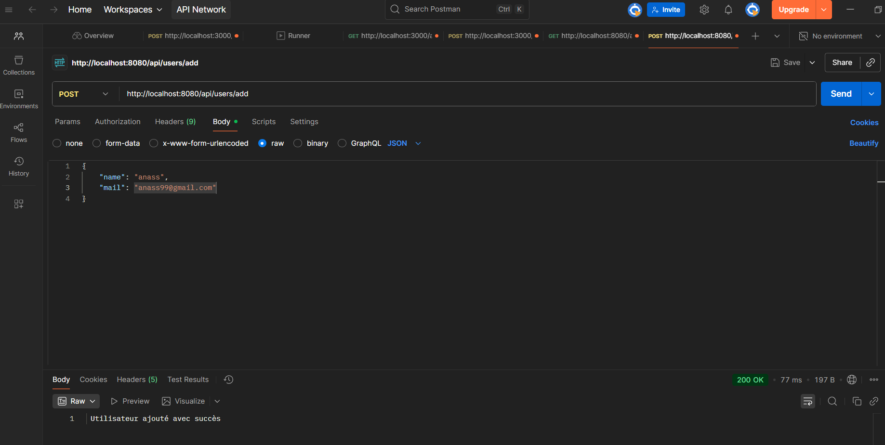

# TP-REST

##  Structure du projet 

| Dossier / Fichier | Description |
|--------------------|-------------|
| `model/` | Contient la classe `User` |
| `service/` | Contient la logique métier (`UserService`) |
| `controller/` | Expose les endpoints REST (`UserController`) |

## Endpoints

| Méthode    | URL               | Description                        |
|------------|-------------------|------------------------------------|
| **GET**    | `/api/users`      | Retourne la liste des utilisateurs |
| **GET**    | `/api/users/{id}` | Retourne un utilisateur spécifique |
| **POST**   | `/api/users/add`  | Ajoute un utilisateur              |
| **DELETE** | `/api/users/{id}` | supprimer un utilisateur           |

## Anass Karim 

